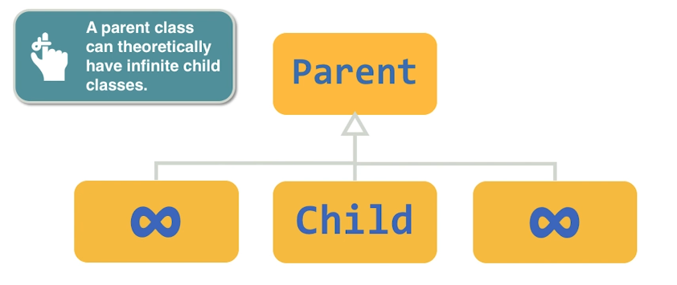
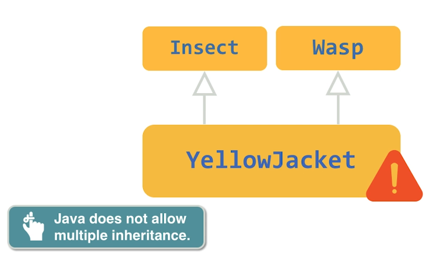
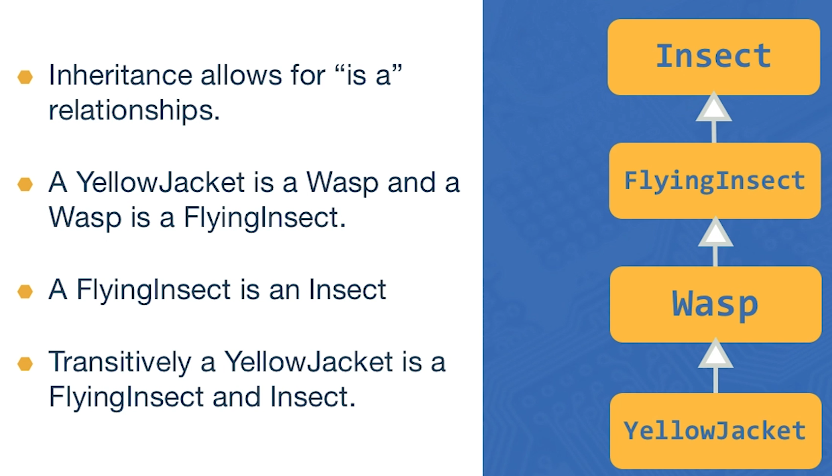
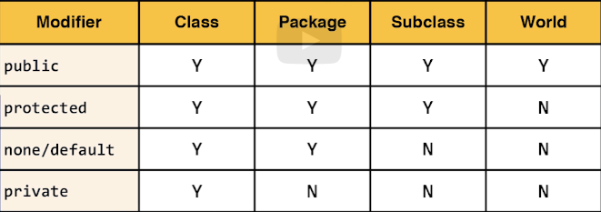

### Overview
In this example, we'll have:
- A base class `Insect` with basic insect properties.
- Subclasses `YellowJacket` and `Ant` that inherit from `Insect` and add specific properties and behaviors.
- Method overriding to provide specific implementations in subclasses.
- An abstract class `FlyingInsect` that defines common behaviors for insects that can fly.

### Base Class: Insect

```java
package lesson11;

// Base class
public class Insect {
    private double weight;
    private int x;
    private int y;

    public static final int DEFAULT_X = 0;
    public static final int DEFAULT_Y = 0;

    // Constructors
    public Insect() {
        this(1.0, DEFAULT_X, DEFAULT_Y);
    }

    public Insect(double weight) {
        this(weight, DEFAULT_X, DEFAULT_Y);
    }

    public Insect(double weight, int x, int y) {
        this.weight = weight;
        this.x = x;
        this.y = y;
    }

    // Accessors
    public double getWeight() {
        return weight;
    }

    public int getX() {
        return x;
    }

    public int getY() {
        return y;
    }

    // Methods
    public void eat(double amount) {
        weight += amount;
        System.out.println("Eating, new weight: " + weight);
    }

    public void move(int newX, int newY) {
        x = newX;
        y = newY;
        System.out.println("Moved to new location: (" + x + ", " + y + ")");
    }

    @Override
    public String toString() {
        return "Insect [weight=" + weight + ", x=" + x + ", y=" + y + "]";
    }
}
```

### Subclass: YellowJacket

```java
package lesson11;

// Subclass of Insect
public class YellowJacket extends Insect {
    private int altitude;

    // Constructors
    public YellowJacket() {
        super();
        this.altitude = 0;
    }

    public YellowJacket(double weight, int x, int y, int altitude) {
        super(weight, x, y);
        this.altitude = altitude;
    }

    // Accessor
    public int getAltitude() {
        return altitude;
    }

    // Methods
    public void fly(int newAltitude) {
        altitude = newAltitude;
        System.out.println("Flying at altitude: " + altitude);
    }

    @Override
    public String toString() {
        return super.toString() + ", YellowJacket [altitude=" + altitude + "]";
    }

    public static void main(String[] args) {
        YellowJacket yellowJacket = new YellowJacket(2.0, 10, 20, 100);
        yellowJacket.fly(200);
        yellowJacket.eat(0.5);
        System.out.println(yellowJacket);
    }
}
```

### Subclass: Ant

```java
package lesson11;

// Subclass of Insect
public class Ant extends Insect {
    private String type;

    // Constructors
    public Ant() {
        super();
        this.type = "Worker";
    }

    public Ant(double weight, int x, int y, String type) {
        super(weight, x, y);
        this.type = type;
    }

    // Accessor
    public String getType() {
        return type;
    }

    @Override
    public String toString() {
        return super.toString() + ", Ant [type=" + type + "]";
    }

    public static void main(String[] args) {
        Ant ant = new Ant(0.5, 5, 5, "Soldier");
        ant.eat(0.1);
        ant.move(10, 10);
        System.out.println(ant);
    }
}
```

### Abstract Class: FlyingInsect

```java
package lesson11;

// Abstract class
public abstract class FlyingInsect extends Insect {
    private int altitude;

    public FlyingInsect(double weight, int x, int y, int altitude) {
        super(weight, x, y);
        this.altitude = altitude;
    }

    public int getAltitude() {
        return altitude;
    }

    public void fly(int newAltitude) {
        altitude = newAltitude;
        System.out.println("Flying at altitude: " + altitude);
    }

    @Override
    public String toString() {
        return super.toString() + ", FlyingInsect [altitude=" + altitude + "]";
    }

    // Abstract method
    public abstract void buzz();
}
```

### Subclass: Bee (Extending Abstract Class)

```java
package lesson11;

public class Bee extends FlyingInsect {

    public Bee(double weight, int x, int y, int altitude) {
        super(weight, x, y, altitude);
    }

    @Override
    public void buzz() {
        System.out.println("Buzzing loudly!");
    }

    @Override
    public String toString() {
        return super.toString() + ", Bee";
    }

    public static void main(String[] args) {
        Bee bee = new Bee(1.0, 10, 20, 100);
        bee.fly(200);
        bee.eat(0.3);
        bee.buzz();
        System.out.println(bee);
    }
}
```

### Summary
- **Inheritance**: `YellowJacket` and `Ant` extend `Insect` to inherit its properties and methods.
- **Class Hierarchies**: `Bee` extends `FlyingInsect`, which itself extends `Insect`, forming a hierarchy.
- **Method Overriding**: `toString()` is overridden in subclasses to provide specific representations.
- **Abstract Class**: `FlyingInsect` defines a common structure for flying insects with an abstract method `buzz()` that must be implemented by subclasses like `Bee`.




But is illegal for a child have multiples parents






---

summary of the access that each visibility modifier provides.



---


### Understanding the `abstract` Modifier

In Java, the `abstract` modifier is used to define a class that cannot be instantiated directly and may contain abstract methods. An abstract method is a method that is declared without an implementation. Subclasses of the abstract class are responsible for providing the implementation of the abstract methods.

#### Key Points:
- **Abstract Class**: An abstract class serves as a blueprint for other classes. It cannot be instantiated on its own and may include abstract methods.
- **Abstract Method**: An abstract method is a method without a body that must be implemented by subclasses.
- **Inheritance**: Subclasses of the abstract class must provide concrete implementations for all abstract methods.

### Example: Cars

We'll use a `Car` class as an abstract base class, with `ElectricCar` and `GasCar` as subclasses that extend `Car` and implement its abstract methods.

### Abstract Base Class: Car

```java
package lesson11;

// Abstract base class
public abstract class Car {
    private String make;
    private String model;
    private int year;

    public Car(String make, String model, int year) {
        this.make = make;
        this.model = model;
        this.year = year;
    }

    public String getMake() {
        return make;
    }

    public String getModel() {
        return model;
    }

    public int getYear() {
        return year;
    }

    // Abstract method
    public abstract void refuel();

    @Override
    public String toString() {
        return "Car [make=" + make + ", model=" + model + ", year=" + year + "]";
    }
}
```

In the `Car` class:
- `make`, `model`, and `year` are common properties for all cars.
- `refuel()` is an abstract method that must be implemented by subclasses.

### Subclass: ElectricCar

```java
package lesson11;

public class ElectricCar extends Car {
    private int batteryLevel;

    public ElectricCar(String make, String model, int year, int batteryLevel) {
        super(make, model, year);
        this.batteryLevel = batteryLevel;
    }

    public int getBatteryLevel() {
        return batteryLevel;
    }

    public void chargeBattery(int amount) {
        batteryLevel += amount;
        System.out.println("Battery charged to: " + batteryLevel + "%");
    }

    @Override
    public void refuel() {
        System.out.println("Charging electric car...");
        chargeBattery(20); // Example amount
    }

    @Override
    public String toString() {
        return super.toString() + ", ElectricCar [batteryLevel=" + batteryLevel + "]";
    }

    public static void main(String[] args) {
        ElectricCar tesla = new ElectricCar("Tesla", "Model S", 2022, 80);
        System.out.println(tesla);
        tesla.refuel();
        System.out.println(tesla);
    }
}
```

In the `ElectricCar` class:
- `batteryLevel` is a specific property for electric cars.
- `chargeBattery(int amount)` is a method to charge the battery.
- `refuel()` is implemented to charge the car's battery.

### Subclass: GasCar

```java
package lesson11;

public class GasCar extends Car {
    private int fuelLevel;

    public GasCar(String make, String model, int year, int fuelLevel) {
        super(make, model, year);
        this.fuelLevel = fuelLevel;
    }

    public int getFuelLevel() {
        return fuelLevel;
    }

    public void addFuel(int amount) {
        fuelLevel += amount;
        System.out.println("Fuel added: " + amount + "L, total fuel level: " + fuelLevel + "L");
    }

    @Override
    public void refuel() {
        System.out.println("Refueling gas car...");
        addFuel(10); // Example amount
    }

    @Override
    public String toString() {
        return super.toString() + ", GasCar [fuelLevel=" + fuelLevel + "]";
    }

    public static void main(String[] args) {
        GasCar ford = new GasCar("Ford", "Mustang", 2020, 50);
        System.out.println(ford);
        ford.refuel();
        System.out.println(ford);
    }
}
```

In the `GasCar` class:
- `fuelLevel` is a specific property for gas cars.
- `addFuel(int amount)` is a method to add fuel to the car.
- `refuel()` is implemented to refuel the car.

### Summary

- **Abstract Class**: `Car` defines common properties (`make`, `model`, `year`) and an abstract method `refuel()` that must be implemented by subclasses.
- **Subclasses**: `ElectricCar` and `GasCar` extend `Car` and provide specific implementations of the `refuel()` method.
- **Method Implementation**: `ElectricCar` has a `chargeBattery` method, and `GasCar` has an `addFuel` method, each called within their respective `refuel()` implementations.

This example demonstrates the use of the `abstract` modifier to create a base class with common properties and behaviors, while leaving specific details to be implemented by subclasses.

---