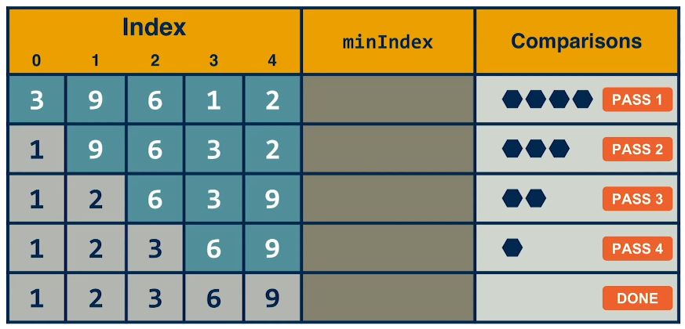

# Selection Sort

Selection Sort is a simple sorting algorithm that works by repeatedly finding the minimum element from the unsorted part of the array and putting it at the beginning.

## Steps
1. **Find the minimum element** in the unsorted array.
2. **Swap** it with the first unsorted element.
3. Move the boundary of the sorted and unsorted part of the array by one element.
4. Repeat until the array is sorted.

## Example

Consider the array `[64, 25, 12, 22, 11]`:

1. Initial array: `[64, 25, 12, 22, 11]`
2. Find the smallest element (`11`), swap with `64`:
    - Array: `[11, 25, 12, 22, 64]`
3. Find the smallest element in the remaining unsorted part (`12`), swap with `25`:
    - Array: `[11, 12, 25, 22, 64]`
4. Find the smallest element in the remaining unsorted part (`22`), swap with `25`:
    - Array: `[11, 12, 22, 25, 64]`
5. The array is now sorted.


*In the image above, the minIndex is pointed at the index of the smallest number found.*


*The gif demonstrates the Selection Sort algorithm in action.*

## Code Example

```java
public class SelectionSort {

    public static void selectionSort(int[] arr) {
        int n = arr.length;

        for (int i = 0; i < n - 1; i++) {
            int minIndex = i;
            for (int j = i + 1; j < n; j++) {
                if (arr[j] < arr[minIndex]) {
                    minIndex = j;
                }
            }
            int temp = arr[minIndex];
            arr[minIndex] = arr[i];
            arr[i] = temp;
        }
    }

    public static void main(String[] args) {
        int[] arr = {64, 25, 12, 22, 11};
        selectionSort(arr);
        System.out.println("Sorted array: ");
        for (int i : arr) {
            System.out.print(i + " ");
        }
    }
}
```
