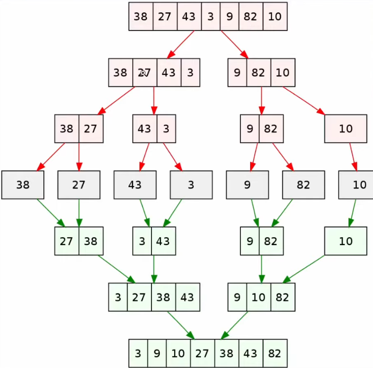

# Selection Sort

Selection Sort is a simple sorting algorithm that works by repeatedly finding the minimum element from the unsorted part of the array and putting it at the beginning.

## Steps
1. **Find the minimum element** in the unsorted array.
2. **Swap** it with the first unsorted element.
3. Move the boundary of the sorted and unsorted part of the array by one element.
4. Repeat until the array is sorted.

## Example

Consider the array `[64, 25, 12, 22, 11]`:

1. Initial array: `[64, 25, 12, 22, 11]`
2. Find the smallest element (`11`), swap with `64`:
    - Array: `[11, 25, 12, 22, 64]`
3. Find the smallest element in the remaining unsorted part (`12`), swap with `25`:
    - Array: `[11, 12, 25, 22, 64]`
4. Find the smallest element in the remaining unsorted part (`22`), swap with `25`:
    - Array: `[11, 12, 22, 25, 64]`
5. The array is now sorted.


*In the image above, the minIndex is pointed at the index of the smallest number found.*


*The gif demonstrates the Selection Sort algorithm in action.*

## Code Example

```java
public class SelectionSort {

    public static void selectionSort(int[] arr) {
        int n = arr.length;

        for (int i = 0; i < n - 1; i++) {
            int minIndex = i;
            for (int j = i + 1; j < n; j++) {
                if (arr[j] < arr[minIndex]) {
                    minIndex = j;
                }
            }
            int temp = arr[minIndex];
            arr[minIndex] = arr[i];
            arr[i] = temp;
        }
    }

    public static void main(String[] args) {
        int[] arr = {64, 25, 12, 22, 11};
        selectionSort(arr);
        System.out.println("Sorted array: ");
        for (int i : arr) {
            System.out.print(i + " ");
        }
    }
}
```

---
---

# Merge Sort

Merge Sort is an efficient, stable, divide-and-conquer sorting algorithm. It works by dividing the unsorted list into n sublists, each containing one element, then repeatedly merging sublists to produce new sorted sublists until there is only one sublist remaining.

## Steps
1. **Divide** the unsorted list into n sublists, each containing one element.
2. **Conquer** by repeatedly merging sublists to produce new sorted sublists.
3. **Combine** the sorted sublists until there is only one sublist remaining.

## Example

Consider the array `[38, 27, 43, 3, 9, 82, 10]`:

1. Initial array: `[38, 27, 43, 3, 9, 82, 10]`
2. Divide into sublists:
    - `[38]` `[27]` `[43]` `[3]` `[9]` `[82]` `[10]`
3. Merge sublists:
    - `[27, 38]` `[3, 43]` `[9, 82]` `[10]`
4. Continue merging:
    - `[3, 27, 38, 43]` `[9, 10, 82]`
5. Final merge:
    - `[3, 9, 10, 27, 38, 43, 82]`


*The image above illustrates the divide and conquer approach of Merge Sort.*


*The gif demonstrates the Merge Sort algorithm in action.*

## Code Example

```java
public class MergeSort {

    public static void mergeSort(int[] arr) {
        if (arr.length < 2) {
            return;
        }
        int mid = arr.length / 2;
        int[] left = new int[mid];
        int[] right = new int[arr.length - mid];

        for (int i = 0; i < mid; i++) {
            left[i] = arr[i];
        }
        for (int i = mid; i < arr.length; i++) {
            right[i - mid] = arr[i];
        }

        mergeSort(left);
        mergeSort(right);

        merge(arr, left, right);
    }

    private static void merge(int[] arr, int[] left, int[] right) {
        int i = 0, j = 0, k = 0;
        while (i < left.length && j < right.length) {
            if (left[i] <= right[j]) {
                arr[k++] = left[i++];
            } else {
                arr[k++] = right[j++];
            }
        }
        while (i < left.length) {
            arr[k++] = left[i++];
        }
        while (j < right.length) {
            arr[k++] = right[j++];
        }
    }

    public static void main(String[] args) {
        int[] arr = {38, 27, 43, 3, 9, 82, 10};
        mergeSort(arr);
        System.out.println("Sorted array: ");
        for (int i : arr) {
            System.out.print(i + " ");
        }
    }
}
```